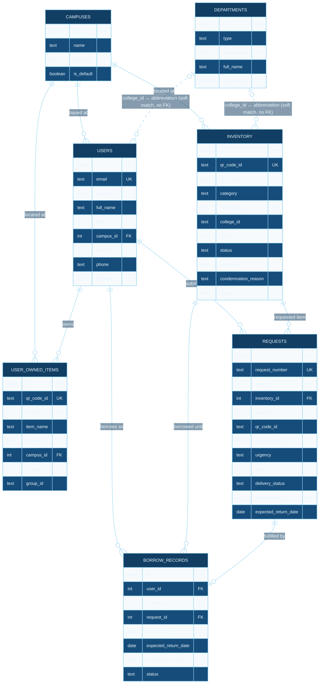
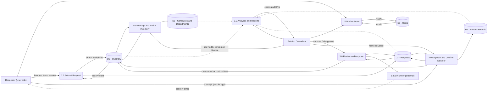
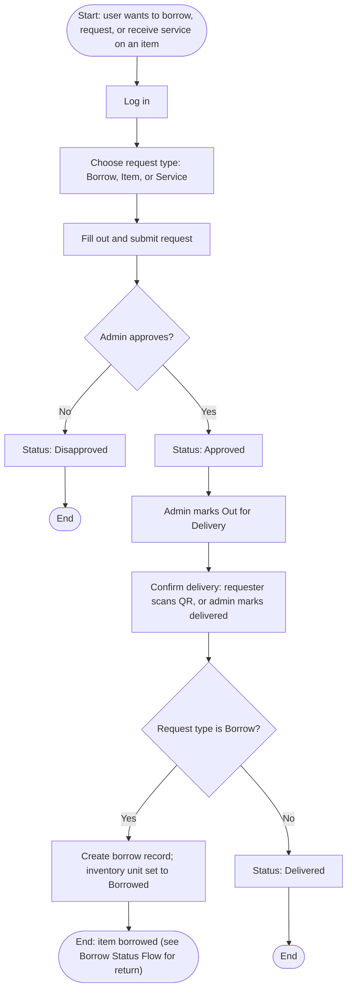

# ManageMo — Entity Relationship, Data Flow & Process Diagrams

**Project:** ManageMo — Inventory & Asset Management
**Client:** Pampanga State University
**Rev:** 2.0.0
**Source:** `database/schema.sql`
**Sheets:** 1 of 3 — ERD · 2 of 3 — DFD · 3 of 3 — Flowchart

The full data model and information flow for the inventory & asset
management system — the PHP web app (Supabase/Postgres backend) and the
companion Flutter delivery-scanner app.

---

## Sheet 01 — Entity Relationship Diagram

The seven live tables in the Supabase database. `request_items` is defined
in `schema.sql` but does not exist in the running database (confirmed by a
direct query) — it's dead code, so it's excluded here. Departments' two
dashed lines are **not** real foreign keys: `college_id` on Users and
Inventory is a free-text abbreviation (e.g. `"CCS"`) matched against
`Departments.abbreviation` in application code (`getMainCampusColleges()`),
with no DB constraint enforcing it.

**Legend**

| Notation | Meaning |
|---|---|
| `PK` | primary key |
| `FK` | foreign key |
| `UK` | unique key |
| `\|\|--o{` | one-to-many, "many" side optional |
| `\|\|--o\|` | one-to-zero-or-one |
| dashed line | logical/soft reference, not a DB-enforced foreign key |

> `REQUESTS.inventory_id` is nullable — a submitted "Item" request with no
> catalog match has no inventory row until an admin approves it (custom
> items only get counted in inventory on approval). `REQUESTS.approved_by`
> is also a foreign key back to Users (the reviewing admin) — its
> relationship line is omitted above since Users↔Requests is already drawn
> once; the FK is still listed in the Requests attribute box.

---

## Sheet 02 — Data Flow Diagram (Level 1)

How a request moves through the system end to end — from submission,
through admin review and dispatch, to delivery confirmation by either an
admin clicking "Mark Delivered" or the requester scanning the item's QR
code in the mobile app.

**Legend**

| Shape | Meaning |
|---|---|
| rectangle | External entity — a person or system outside ManageMo |
| circle | Process — a numbered transformation of data |
| cylinder | Data store — a table at rest |
| solid line | write / read-write flow |
| dotted line | read-only flow |

> Process 4.0 is the one place the web app and mobile app converge: both
> "Mark Delivered" (admin) and a QR scan (requester, per unit) run the
> identical delivery-confirmation logic against the same Requests /
> Inventory / Borrow Records stores. Dotted lines mark read-only flows
> (Process 6.0 reading each store for dashboards; the email notice, which
> leaves the system rather than writing to a store).

---

## Sheet 03 — Request Lifecycle Flowchart

Unlike the DFD (which shows data moving between processes and stores), this
is the actual step-by-step path a single request takes, including its two
real decision points: does the admin approve it, and is it a borrow request
(which continues on as an active loan) versus an item/service request
(which ends at "Delivered").

**Legend**

| Shape | Meaning |
|---|---|
| stadium (rounded ends) | Start / End terminator |
| rectangle | A step or state change |
| diamond | Decision point — exactly one branch is taken |

> Reaching "End: item borrowed" isn't the end of that unit's story — it
> later moves through `active → returned` or `active → overdue`, tracked
> separately in Borrow Records (see the Borrow Status Flow in
> `SYSTEM_DOCUMENTATION.txt`). This flowchart stops there to keep the
> request-submission path readable on its own.

---

*Generated from the live schema + current application logic, not a static spec. — ManageMo v2.0.0*
